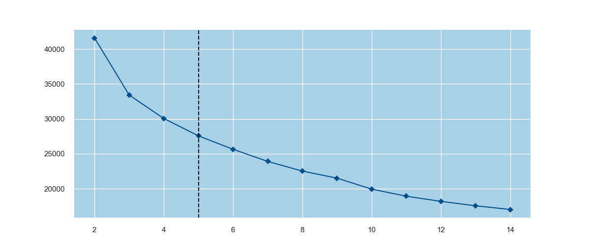
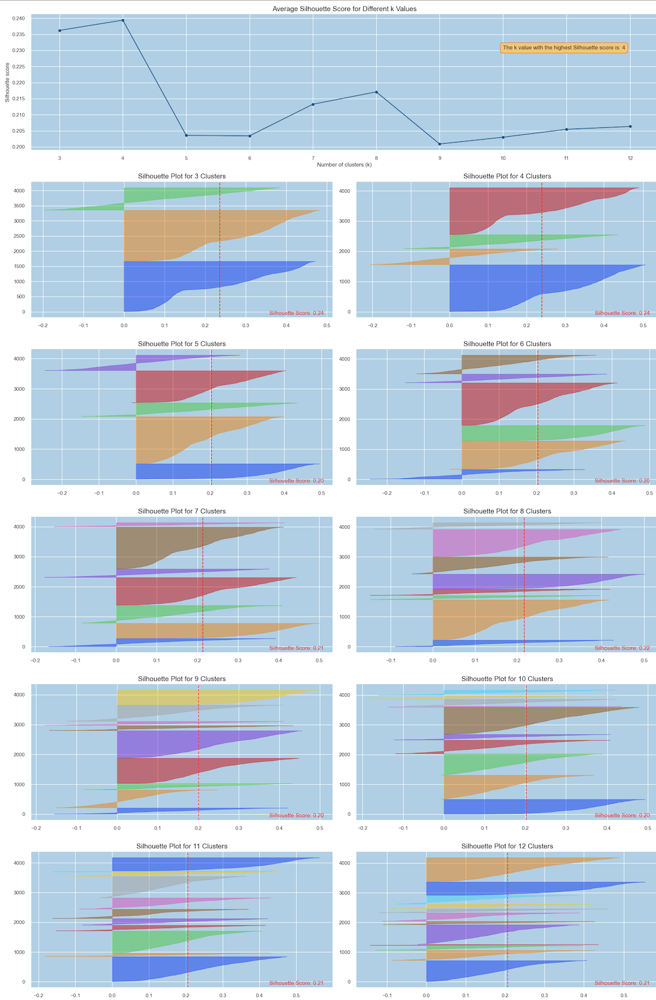
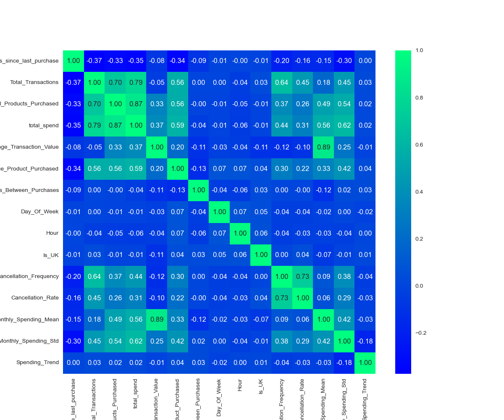
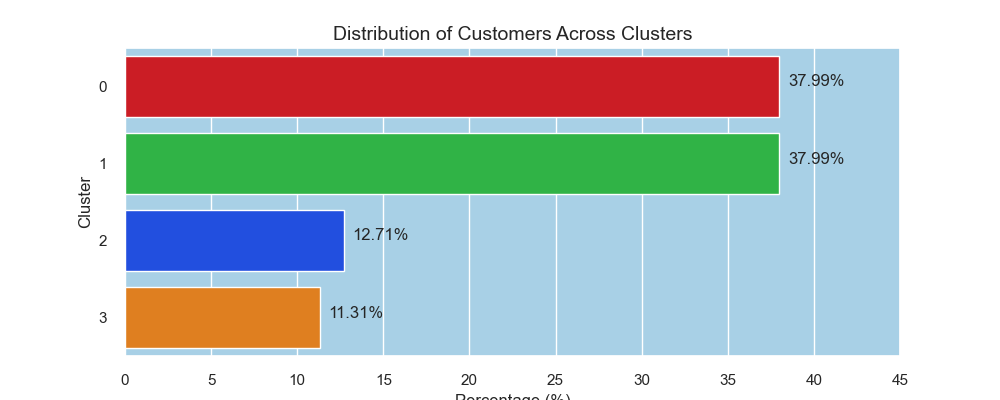
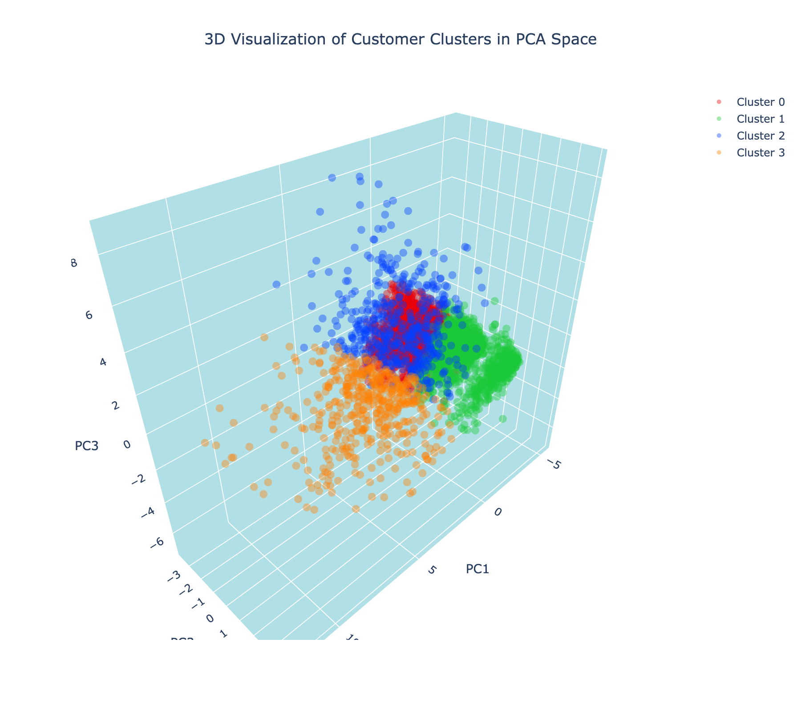
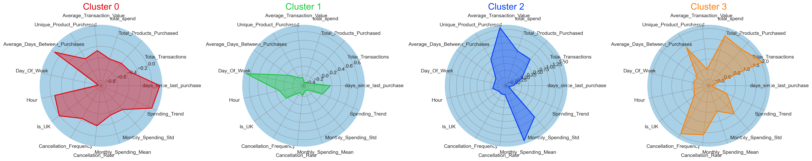

# 🛍️ Customer Segmentation & Recommendation System

This project focuses on enhancing marketing strategies and increasing sales by analyzing customer purchasing behavior. Using a real-world dataset from a UK-based online retailer, we segmented customers into distinct groups using K-Means clustering and built a recommendation system that suggests top-selling products within each segment.

---

## 📌 Objectives

- Segment customers into meaningful groups based on purchasing behavior.
- Generate actionable insights using advanced feature engineering.
- Recommend relevant products that similar customers haven’t purchased yet.
- Help businesses improve targeting through data-driven strategies.

---

## 📂 Dataset

- **Source:** [UCI Machine Learning Repository – Online Retail Dataset](https://archive.ics.uci.edu/ml/datasets/online+retail)
- **Description:** Contains transactional data from a UK-based online retailer between 2010 and 2011.

---

## 🔍 Project Workflow

### 1. Data Cleaning & Transformation
- Removed duplicates and handled missing/cancelled transactions.
- Fixed anomalies in product codes, descriptions, and pricing.

### 2. Feature Engineering
- Built RFM (Recency, Frequency, Monetary) features.
- Added product diversity, behavioral, geographic, and seasonal features.

### 3. Clustering with K-Means
- Scaled features and used PCA for dimensionality reduction.
- Used Elbow and Silhouette methods to find the optimal number of clusters.
- Visualized clusters in 2D and 3D using principal components.

### 4. Cluster Profiling
- Used radar and histogram charts to analyze customer segments.
- Identified behavioral trends across different customer groups.

### 5. Recommendation System
- For each cluster, identified top-selling products.
- Recommended products not yet purchased by customers in that cluster.

---

## 📊 Key Visualizations

| Description | Preview |
|-------------|---------|
| 📉 **Elbow Plot** – To determine optimal cluster count |  |
| 📉 **Silhouette Plot** – To determine optimal cluster count |  |
| 📍 **Correlation Heatmap** – Relationship between engineered features |  |
| 📊 **Cluster Distribution** – Customers projected onto 2D space |  |
| 📊 **3D Cluster Distribution (PCA)** – Customers projected onto 3D space |  |
| 📈 **Radar Chart** – Cluster profile comparison across key features |  |

---

## 💡 Key Insights

- Cluster profiles revealed diverse customer behaviors, including loyal buyers and one-time purchasers.
- High-value customers tend to buy more frequently and across a wider product range.
- Tailored product recommendations offer a strategic upselling opportunity within each segment.

---

## 🛠️ Tech Stack

- **Python:** Pandas, NumPy, Scikit-learn, Seaborn, Plotly, Yellowbrick
- **Models & Methods:** KMeans Clustering, PCA, IsolationForest
- **Visualization:** Matplotlib, Seaborn, Plotly

---

